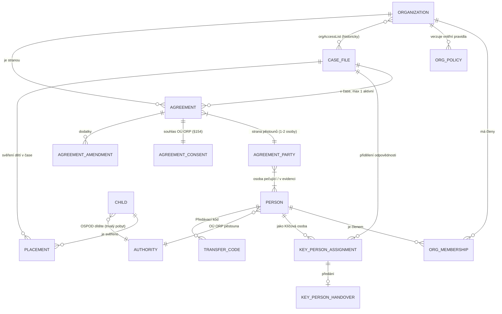
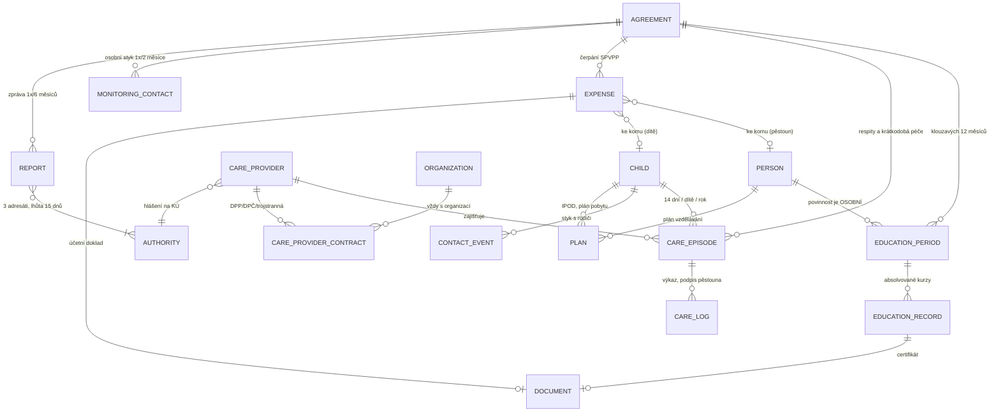
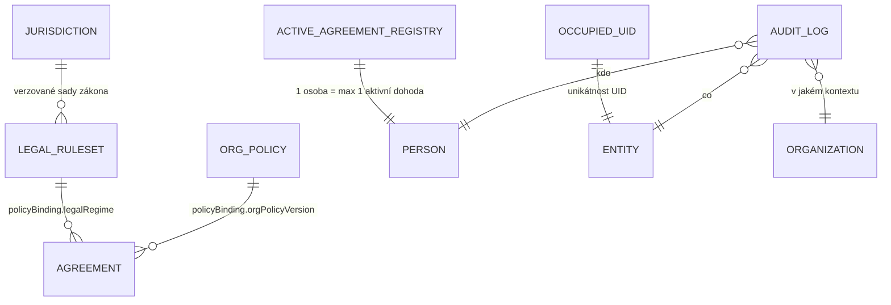

# 03 — Strom vazeb, profily a nastavení systému

Navazuje na [01 — Právní analýza](./01-pravni-analyza-a-korekce-zadani.md) a
[02 — Architektura řešení](./02-architektura-reseni.md).

---

## 0. Zaznamenaná rozhodnutí

| Otázka | Rozhodnutí |
| --- | --- |
| `transitionGapDays` | **konec + 1** — nová dohoda účinná dnem následujícím po zániku staré, bez mezery |
| Rozsah Klíčové osoby | rodiny a dohody **patří organizaci**; Klíčová osoba je vztah odpovědnosti, ne hranice přístupu |
| Klíčová osoba jako subjekt | ano, **pověřená fyzická osoba** může být sama doprovázejícím subjektem |
| AI a pseudonymizace | schváleno dle dok. 02 sekce 6 |
| Limity čerpání SPVPP | **odloženo na konec**; nyní jen evidence *kolik a ke komu* |
| Vzdělávání | priorita: **hodiny + doklady/certifikáty** |
| Respity | priorita: **plnění dnů odpočinku; i jedna hodina = jeden den** |

### Zpřesnění k rozsahu přístupu, které navrhuji potvrdit

Z „dohody patří organizaci“ plyne **čtení v rozsahu organizace**. Pro data dětí
v pěstounské péči je ale hrubý org-wide přístup slabý — GDPR minimalizace i standardy
kvality míří na „need to know“. Navrhuji proto ne dvě, ale tři úrovně:

1. **Hranice přístupu = organizace** (technicky vynuceno: `orgAccessList`).
2. **Výchozí filtr UI = moje rodiny** — Klíčová osoba vidí primárně své.
3. **Přístup k nepřidělené rodině je možný, ale zaznamenaný** — otevření spisu, ke
   kterému nejsem přidělen, jde do auditu jako `CROSS_CASE_ACCESS`. Není to blokace,
   je to dohledatelnost; zástupy a krizové situace musí být bez friction.

Tím se drží tvoje pravidlo („patří organizaci“) a zároveň zůstává stopa, kdo se komu
díval do spisu. To je přesně to, co inspekce a GDPR kontrola ověřuje.

### Zúžení rozsahu SPVPP pro tuto fázi

Nyní stavíme **jen evidenci**: `Expense` s vazbou na pěstouna a/nebo dítě, kategorií
a částkou. **Nestavíme** pásma § 5c, automatický výpočet výše příspěvku ani výkaznictví
pro MPSV. Datový model ale ta pole už **připraví** (`rightCode`, `rulesetId`,
`paymentRoute`), aby se dopočet dal přidat později bez migrace historie — jinak by po
zapnutí limitů nešlo vyhodnotit nic ze starých dat.

---

## 1. Klíčová osoba — role a odchod

### Role v systému

```
Person ──< OrgMembership >── Organization
```

Zadání mělo `users/{uid}.organizationId: string` — jednu organizaci na uživatele.
**To nestačí.** Klíčová osoba může v čase přejít jinam, může mít krátce přesah a audit
musí vědět, v jakém organizačním kontextu úkon proběhl. Proto členství jako samostatná
entita s časovou platností:

```ts
interface OrgMembership {
  id: string
  personId: string
  organizationId: string
  role: 'org_admin' | 'key_person' | 'guest'
  fteFraction: number            // 1.0 = plný úvazek → kapacita se váže k FTE, ne k osobě
  isDelegatedNaturalPerson: boolean   // pověřená FO = sama doprovázejícím subjektem
  validFrom: string
  validTo: string | null
  active: boolean
}
```

Role se čte z členství, **ne z JWT claims** — pravidlo zadání zůstává v platnosti
a členství je jen jeho přesnější nosič.

### Pověřená fyzická osoba jako subjekt

Když je Klíčová osoba sama doprovázejícím subjektem (`isDelegatedNaturalPerson`),
platí navíc:
- Organizace v systému existuje, ale je „jednoosobová“ — `Organization.subjectType:
  'delegated_natural_person'`.
- Instrukce 3/2025 jí umožňuje ponechat si přiměřenou část SPVPP jako odměnu **až po**
  zabezpečení všech práv a povinností → v evidenci výdajů to musí být samostatná
  kategorie, ne „režie“.
- **Její odchod nebo zánik pověření = zánik subjektu**, ne přeobsazení. Viz scénář E.

### Scénáře odchodu Klíčové osoby

Východisko, které určuje všechno ostatní: **dohoda je mezi pěstounem a subjektem, ne
pracovníkem** (§ 47b). Odchod pracovníka **není** zákonným důvodem výpovědi ze strany
subjektu — § 47c odst. 2 zná jen tři důvody a tento mezi nimi není.

> **Z toho plyne tvrdé pravidlo: rodiny nikdy „nepřecházejí s pracovníkem“ hromadně.
> Přechod k jiné organizaci může iniciovat výhradně pěstoun sám.**
> Kdyby systém umožnil pracovníkovi nebo organizaci převést portfolio, byl by to úkon
> bez právního titulu a proti chráněnému zájmu — kontinuitě péče o dítě.

| # | Scénář | Kdo rozhoduje | Mechanismus |
| --- | --- | --- | --- |
| **A** | **Zástup** (nemoc, dovolená) | org_admin | dočasné přidělení, původní Klíčová osoba zůstává vlastníkem. Metodika: přenositelné **jen v případě nutnosti**, pravidla musí být ve vnitřních předpisech a **rodině známa** → systém rodinu informuje. |
| **B** | **Trvalé přeobsazení v rámci organizace** (výchozí při odchodu) | org_admin | `keyPersonAssignment` se uzavře a otevře nová; předávací protokol; rodina i dítě informováni |
| **C** | **Pěstoun jde za pracovníkem do jiné organizace** | **pěstoun** | **N samostatných přechodů** přes Předávací kód (dok. 02 sekce 3). Žádná dávková operace. Pracovník ani nová organizace kód negenerují. |
| **D** | **Střet zájmů** (příbuzenství, pěstoun je zaměstnancem subjektu) | org_admin / ORP | povinné přeobsazení, `conflictOfInterest` na přidělení; u pěstouna-zaměstnance je to i důvod nesouhlasu ORP s dohodou |
| **E** | **Zánik pověřené FO jako subjektu** | ORP / KÚ | **všechny** dohody zanikají; hromadné uvolnění pěstounů, každý dostane Předávací kód; ORP informován; závěrečné zprávy povinně |
| **F** | **Prevence syndromu vyhoření** | org_admin na žádost pracovníka | totéž jako B, ale s vlastním důvodem — metodika ho uvádí výslovně |
| **G** | **Žádost pěstouna nebo dítěte o změnu pracovníka** | pěstoun / dítě | totéž jako B; **odůvodněná žádost je legitimní důvod** a musí být zaznamenatelná |

### Předávací protokol (scénáře B, D, F, G)

```ts
interface KeyPersonHandover {
  id: string
  caseFileId: string
  fromPersonId: string
  toPersonId: string
  reason: 'departure' | 'reassignment' | 'conflict_of_interest' | 'burnout_prevention'
        | 'caregiver_request' | 'child_request' | 'substitution'
  temporary: boolean                 // true = zástup, vlastník se nemění
  effectiveFrom: string
  effectiveTo: string | null         // jen u zástupu
  familyNotifiedAt: string | null    // metodika: pravidla musí být rodině známa
  openItems: {                       // co si přebírající musí přečíst
    pendingTasks: number
    overdueMonitoringContact: boolean
    upcomingReportDue: string | null
    openEducationDeficit: boolean
  }
  createdByUserId: string
}
```

**Co se s odchodem děje s daty:**
- Přístup odcházející osoby se odebírá ukončením členství (`validTo`, `active: false`).
  Musí to zneplatnit i **offline session a lokální cache** na jejím zařízení (dok. 02
  sekce 5).
- **Autorství v historii se nikdy nemaže.** Zápisy v timeline, zprávy a výkazy zůstávají
  přiřazené původnímu autorovi — spis je append-only. Anonymizace autora by porušila
  dohledatelnost, kterou inspekce vyžaduje.
- Kapacita: po přeobsazení se přepočte zatížení přebírajících osob proti
  `recommendedFamiliesPerFte` a překročení se **hlásí org_adminovi** (nikoli blokuje).

---

## 2. Strom vazeb

### 2.1 Jádro — organizace, osoby, spis, dohoda, dítě



**Vazby, které se snadno udělají špatně:**

| Vazba | Kardinalita | Proč právě takto |
| --- | --- | --- |
| `AGREEMENT` → `PERSON` | přes `AGREEMENT_PARTY`, **1–2 osoby** | § 47b odst. 7 — manželé uzavírají **společně** |
| `PERSON` → aktivní `AGREEMENT` | **max 1**, globálně napříč tenanty | § 47b odst. 6; registr per **osoba**, ne per dohoda |
| `CASE_FILE` → `AGREEMENT` | 1:N v čase, **max 1 aktivní** | rodina trvá, dohody se v čase mění a mohou být u různých organizací |
| `ORGANIZATION` → `CASE_FILE` | **M:N historicky** (`orgAccessList`) | rodina mění subjekt; přístup se nesmí ztratit zpětně |
| `CHILD` → `CASE_FILE` | přes `PLACEMENT`, **časově omezené** | dítě může odejít a vrátit se, změnit právní status; zadání to mělo jako `familyId` na dítěti, což historii ztratí |
| `CHILD` → `AUTHORITY` | **dvě různé** vazby | § 47b odst. 5: adresátem zprávy je ORP pěstouna **i** ORP trvalého pobytu dítěte |
| `AGREEMENT` → `AGREEMENT_CONSENT` | **1:1 povinná** u pověřené osoby | bez souhlasu dohoda nevznikne a nelze na ni vyplácet SPVPP |

`PLACEMENT` je nová entita, kterou zadání nemá:

```ts
interface Placement {
  id: string
  childId: string
  caseFileId: string
  custodyType: 'pre_foster' | 'foster' | 'foster_temporary' | 'guardianship' | 'factual_care'
  startedOn: string
  endedOn: string | null
  endReason?: 'majority' | 'return_to_family' | 'moved_to_other_care' | 'court_decision'
  courtDecisionRef?: string
  legalForceOn?: string          // právní moc → od ní běží 30denní lhůta na dohodu
}
```

### 2.2 Agenda — vzdělávání, respity, výdaje, sledování



**Vzdělávání — model, který unese 18/24 h, klouzavé období i převod:**

```ts
interface EducationPeriod {
  id: string
  personId: string               // OSOBNÍ, ne rodinná povinnost
  agreementId: string
  ordinal: number                // 1., 2., … období
  startsOn: string               // 1. období = den uzavření dohody
  endsOn: string                 // startsOn + 12 měsíců - 1 den
  careTypeAtStart: 'mediated' | 'non_mediated'
  requiredHours: number          // 24 | 18 — z rulesetu k datu startsOn
  carriedInHours: number         // převod z předchozího období
  completedHours: number         // dopočítané z EDUCATION_RECORD
  carriedOutHours: number        // přebytek do dalšího období
  rulesetId: string
  status: 'open' | 'fulfilled' | 'unfulfilled'
}

interface EducationRecord {
  id: string
  educationPeriodId: string
  personId: string
  courseTitle: string
  provider: string
  hours: number                  // 1 hodina = 60 minut
  completedOn: string
  form: 'in_person' | 'online_live' | 'elearning' | 'consultation' | 'supervision'
  certificateDocumentId: string | null
  verifiedByPersonId: string | null
  verifiedAt: string | null
}
```

Ukazatel plnění se pak čte jako **„potřeba 24 − 3 převedené = 21; splněno 18 → chybí 3“**.
`form` je tam proto, že e-learningem nelze pokrýt celou dotaci.

**Respity — den je nedělitelná jednotka:**

```ts
interface CareEpisode {
  id: string
  agreementId: string
  childId: string
  kind: 'short_term' | 'full_day'          // § 47a odst. 2 písm. a) vs b)
  shortTermReason?: 'sick_leave' | 'caring_for_relative' | 'childbirth'
                  | 'personal_matters' | 'death_of_relative'
  // Rozhodující pole: dny, ne hodiny. I jedna hodina v daném dni = celý den.
  days: string[]                            // ['2026-07-13','2026-07-14']
  dayCount: number                          // = days.length, denormalizace pro součty
  hoursPerDay?: number[]                    // jen informativně
  careProviderId: string | null
  location?: string
  ipodAligned: boolean
  overLimitJustification: string | null     // povinné nad 14 dní
  createdOffline: boolean
}
```

Součet plnění = **počet unikátních dnů za dítě a kalendářní rok**, nikoli hodin.
`days` jako množina dat je proto správnější než `from`/`to` — respit může být
nesouvislý (metodika doporučuje u malých dětí kratší opakované úseky) a duplicitní
zápis stejného dne se dá deduplikovat.

**Výdaje v této fázi (zúžené):**

```ts
interface Expense {
  id: string
  organizationId: string
  agreementId: string
  // Ke komu se výdaj váže — to je v této fázi to hlavní
  personId: string | null       // pěstoun
  childIds: string[]            // dítě/děti
  amountMinor: number
  currency: string
  incurredOn: string
  category: string              // z konfigurace organizace
  // Připraveno pro pozdější limity, zatím se nevyhodnocuje:
  rightCode: 'a'|'b'|'c'|'d'|'e'|'f'|'g' | null
  rulesetId: string | null
  paymentRoute: 'direct_to_provider' | 'reimbursed_to_caregiver'
  invoiceIssuedTo: 'organization' | 'caregiver' | 'unknown'
  documentId: string | null
  careEpisodeId: string | null
  educationRecordId: string | null
}
```

### 2.3 Systém — parametry, registry, audit



---

## 3. Profily

Mobile-first: každý profil je **obrazovka s hlavičkou, stavovým pásem a sekcemi**.
Hlavička drží to, co musí být vidět bez scrollování; primární akce je v dosahu palce.

### 3.1 Spis rodiny

| Část | Obsah |
| --- | --- |
| **Hlavička** | UID (`ROD-2026-001`), název rodiny, stav, Klíčová osoba, obec |
| **Stavový pás** | ⚠️ **Osobní styk**: „za 9 dní překročí 2 měsíce“ · **Zpráva**: „do 12. 8.“ · **Dohoda**: aktivní do 31. 12. |
| **Primární akce (palec)** | **Nový zápis** · **Diktovat** · Naplánovat návštěvu |
| Osoby | pěstouni (osoba pečující / v evidenci), děti s věkem a právním statusem |
| Dohoda | aktivní dohoda, stav souhlasu ORP, právní režim, historie dohod |
| Časová osa | zápisy z návštěv, hovory, diktáty, komunikace s OSPOD |
| Vzdělávání | ukazatel **per pěstoun** (klouzavé období, ne rok) |
| Respity | vyčerpané dny **per dítě** za rok |
| Výdaje | součty ke komu se vážou |
| Úkoly · Kalendář · Dokumenty · Plány (IPOD, plán pobytu) |
| Úřady | OSPOD pěstouna, OSPOD dítěte |

### 3.2 Pěstoun (osoba pečující / osoba v evidenci)

| Část | Obsah |
| --- | --- |
| **Hlavička** | UID (`PES-2026-015`), jméno, **typ**: osoba pečující / v evidenci, **typ PP**: zprostředkovaná / nezprostředkovaná |
| **Stavový pás** | **Vzdělávání**: 18/24 h za období do 14. 3. · **Přechod**: „Uvolněn k přechodu“ + Předávací kód |
| Kontakt | telefon, e-mail, adresa, datum poslední osobní návštěvy |
| Dohoda | aktuální + historie (i u jiných organizací, pokud je v `orgAccessList`) |
| Vzdělávání | období, kurzy, **certifikáty** — s jednoklikovým nahráním fotky dokladu |
| Respity | jaké dny byly čerpány pro které dítě |
| Děti | svěřené děti přes `Placement` |
| Rodina | vazba na spis |

### 3.3 Dítě

| Část | Obsah |
| --- | --- |
| **Hlavička** | UID (`DET-2026-099`), jméno, věk, **právní status** svěření |
| **Stavový pás** | ⚠️ **věk < 2 roky ⇒ nárok na respit nevzniká** · **respity**: 6/14 dní · stupeň závislosti |
| Identifikátory | `nationalIdentifiers` (rodné číslo) — **maskované**, odkrytí jde do auditu |
| Svěření | historie `Placement` — kdy přišlo, právní moc, případný odchod |
| Škola | zařízení, kontakt |
| Kontakty s rodiči | plánované i uskutečněné, vyhodnocení |
| Plány | IPOD (přijatý od OSPOD), plán průběhu pobytu |
| Úřad | OSPOD dítěte podle trvalého pobytu |

### 3.4 Dohoda

| Část | Obsah |
| --- | --- |
| **Hlavička** | UID (`DOH-2026-042`), stav, platnost od–do, organizace |
| **Stavový pás** | **Souhlas ORP**: požádáno 3. 2. / uděleno · **Právní režim**: po novele 2025 · ⚠️ **nejbližší možný zánik: 31. 12.** |
| Strana pěstounů | **1–2 osoby** |
| Životní cyklus | `draft → active → suspended → terminated/expired`; u výpovědi **dopočítané** datum zániku a lhůta doručení |
| Dodatky | podstatné (vyžadují souhlas ORP) vs nepodstatné |
| Vnitřní pravidla | verze `orgPolicy`, na kterou dohoda odkazuje |
| SPVPP | evidované výdaje (bez limitů — tato fáze) |

### 3.5 Klíčová osoba

| Část | Obsah |
| --- | --- |
| **Hlavička** | UID (`PRA-2026-005`), jméno, role, **FTE**, případně „pověřená FO = subjekt“ |
| **Stavový pás** | **Zatížení**: 21 rodin / doporučeno 18–23 při 1,0 FTE · **po termínu**: 3 úkoly |
| Přidělené rodiny | seznam + zástupy |
| Moje agenda | úkoly, kalendář, blížící se zprávy a osobní styky |
| Historie | členství v organizacích, předání spisů |

### 3.6 Organizace (doprovázející subjekt)

| Část | Obsah |
| --- | --- |
| **Hlavička** | název, IČO, **typ subjektu**: pověřená PO / pověřená FO / OÚ ORP / KÚ |
| Pověření | rozsah, platnost, KÚ který pověřil |
| Lidé | členství, role, FTE, kapacita |
| Vnitřní pravidla | verze, platnost, na co odkazují dohody |
| Dohody | aktivní, koncepty, blížící se zániky |
| Datová schránka | ISDS ID, hlavičkový papír |

### 3.7 Poskytovatel péče

| Část | Obsah |
| --- | --- |
| **Hlavička** | jméno / název, FO nebo PO, vztah k rodině |
| **Stavový pás** | **Hlášení na KÚ**: nahlášeno 4. 3. · **Bezúhonnost**: presumovaná / potvrzená / ⚠️ neprošla · **Zdravotní způsobilost**: čestné prohlášení |
| ⚠️ Blokace | `livesInHouseholdWithChild = true` ⇒ **nelze sjednat úplatu** |
| Smlouvy | DPP / DPČ / trojstranná / faktura |
| Výkazy | `careLog` s **podpisem pěstouna** |

---

## 4. Nastavení systému

Tři úrovně, odpovídající třem vrstvám parametrů z dok. 02.

### 4.1 Platforma — `superadmin`

| Skupina | Položky |
| --- | --- |
| **Jurisdikce** | seznam, výchozí, časová zóna, měna |
| **Zákonné sady pravidel** | verze, `validFrom/To`, zdroje s příznakem závaznosti, náhled „co se změní“, aktivace budoucí verze |
| **Mapa písmen práv** | `rightsCodes` per verze — novela 2024 přečíslovala a)–g) |
| **Masky UID** | `ROD/DOH/PES/DET/PRA-YYYY-XXX`, délka pořadové části, chování při přetečení |
| **Přechody pěstounů** | `releaseWindowDays` 31 · `transitionGapDays` **1** · `claimWindowDays` 60 · `allowSelfServiceOnRecordedNotice` **true** |
| **Organizace** | zakládání, pověření, deaktivace |
| **AI** | poskytovatelé, EU lokalita, pseudonymizační slovníky, on-device STT preferováno, retence |
| **Integrace** | ISDS, PDF, iCal, vyhledávací index |
| **Feature flags** | mj. `spvppLimitsEnabled: false` — pásma § 5c zapneme později |

### 4.2 Organizace — `org_admin`

| Skupina | Položky |
| --- | --- |
| **Vnitřní pravidla (verzovaná)** | sazby a stropy respitů (letní pobyt, příměstský tábor, víkend, individuální tábor), hodinové sazby hlídání DO vs osoby blízké, max. hodin/den, roční limit krátkodobé péče na dítě |
| **Kategorie výdajů** | vlastní strom kategorií + volitelné mapování na písmena § 47a odst. 2 |
| **Kapacita** | doporučené rozmezí rodin na 1,0 FTE (default 18–23), tvrdý strop pro varování |
| **Lhůty a upozornění** | předstih varování u osobního styku, zprávy, vzdělávání, konce dohody |
| **Šablony dokumentů** | smlouva, IPPD, zpráva pro OSPOD — verzované, per právní režim |
| **Lidé a role** | členství, FTE, zástupy, střet zájmů |
| **Úřady** | místně příslušné ORP, KÚ, datové schránky |
| **Identita** | logo, hlavičkový papír, ISDS |
| **Portál pěstouna** | co je pěstounovi viditelné (viz otevřená otázka) |

**Zásada:** verze vnitřních pravidel, na kterou odkazuje **aktivní dohoda**, se nesmí
změnit — jen nahradit novou verzí a dodatkem k dohodě.

### 4.3 Uživatel

| Skupina | Položky |
| --- | --- |
| **Jazyk a formáty** | locale nezávisle na jurisdikci (pěstoun může mít `uk`, organizace `CZ`) |
| **Terén / offline** | rozsah předstahovaných dat (dnes / 7 dní / mé rodiny), TTL cache, jen přes Wi-Fi |
| **Diktování** | on-device vs server, jazyk diktátu |
| **Upozornění** | co, kdy, kanál |
| **Bezpečnost** | biometrie pro vstup, vzdálené odhlášení, smazání lokální cache |

---

## 5. Co dál a co zůstává otevřené

**Připraveno k implementaci:** strom vazeb, profily, nastavení, model vzdělávání
a respitů, model odchodu Klíčové osoby.

**Otevřené:**
1. **Portál pěstouna** — má vidět jen vzdělávání a plánované akce, nebo i výdaje, které
   se k němu vážou? Ovlivňuje oprávnění a profil 3.2.
2. **Používají systém i OÚ ORP** jako subjekty? Pokud ano, musíme vynutit oddělení
   kontrolní a podpůrné role mezi dvěma zaměstnanci.
3. **Chybějící zdroje**: vyhláška 473/2012 Sb. (§ 4, 4a, 5, **5f** — spoluúčast na stravě
   a ubytování je potřeba už pro respity) a OZ 89/2012 část druhá.
4. **Potvrzení tříúrovňového přístupu** ze sekce 0 — org-wide čtení + výchozí filtr
   na vlastní rodiny + audit křížového přístupu.
